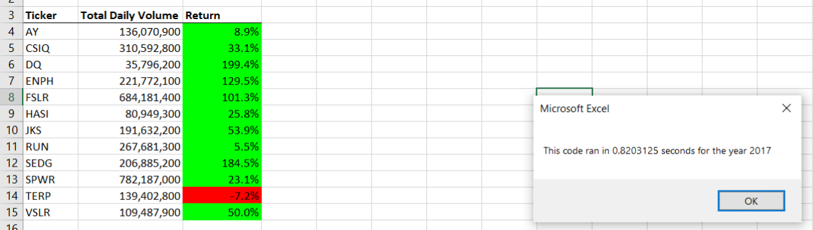
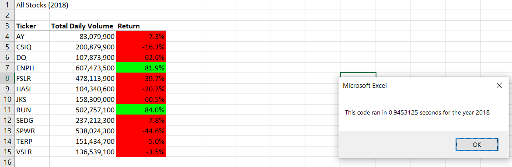

# VBA-Challenge

## Overview Of Project
The purpose of this challenge is to refine the code within excel making it easier to read, while being more efficient. By making the code more efficient it allows the code to run faster and more smoothly on a larger data set. A variety of code can be used to run a small data set, however in order to get best results across a large data set it is necesary to optimize the code.
## Results

## Summary

